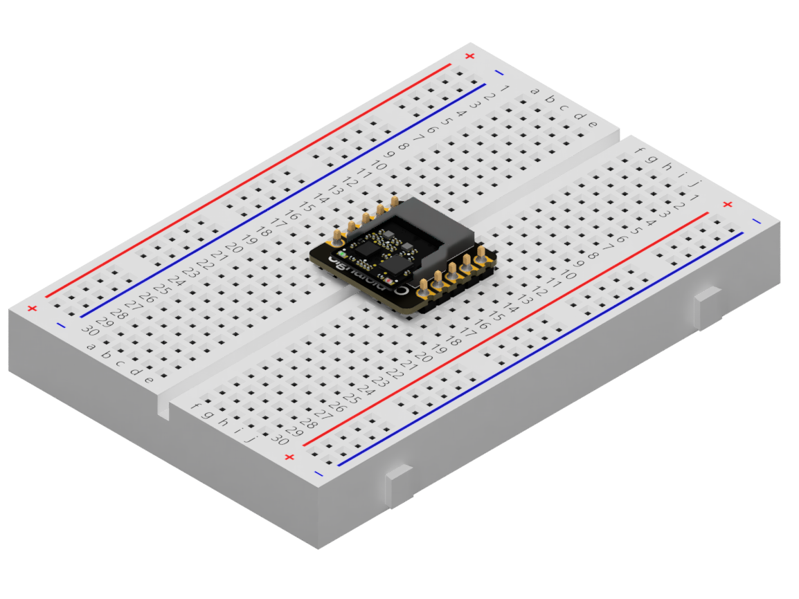

# Signaloid C0-microSD Hot-Pluggable Hardware Module
The Signaloid C0-microSD is a hot-pluggable system-on-module (SoM) based on the popular iCE40 FPGA from Lattice semiconductor. The SoM is in a microSD form factor and implements an SD-compatible interface. When plugged into an SD host system, it is accessible as an SD mass storage device. SD hosts can use writes and reads to interface to logic within the SOM.

The Signaloid C0-microSD has two main use cases: You can either **(1) use it as a hot-pluggable co-processor module** (it implements a subset of Signaloid's C0 processor), or you can **(2) use it as a hot-pluggable FPGA module**. The Signaloid C0-microSD contains a bootloader that exposes the hardware module's functionality as an SD mass storage device, making it easy to configure new applications in either of the two use cases by performing I/O to the module when it is plugged into a host system. 

You can use it to prototype your designs on a breadboard using a microSD breakout board or integrate it into your new PCB designs by adding a dedicated microSD slot. You can even plug the Signaloid C0-microSD into an existing platform that supports microSD cards (like the Bee Data Logger or the Adafruit Adalogger) and use it as a co-processor.

|  |  |  |
|:--:| :--:| :--:|
| **Figure 1:** C0-microSD size comparison to US 1¢ coin. | **Figure 2:** C0-microSD connected to an SDDev board. | **Figure 3:** C0-microSD populating a breadboard using a microSD breakout board. |

## Getting started with the C0-microSD
You can find example RTL designs, along with instructions on how to flash them [here](https://github.com/signaloid/C0-microSD-hardware). You can also find example applications for the built-in Signaloid Core [here](https://github.com/signaloid?q=Signaloid-C0-microSD-Demo). In this documentation page, you will find information on how the different [modes of operation](/hardware-overview/modes-of-operation.html) of the C0-microSD work, as well as instructions on how to [perform commonly-needed operations](/guides/) like identifying, switching, and flashing your C0-microSD.
