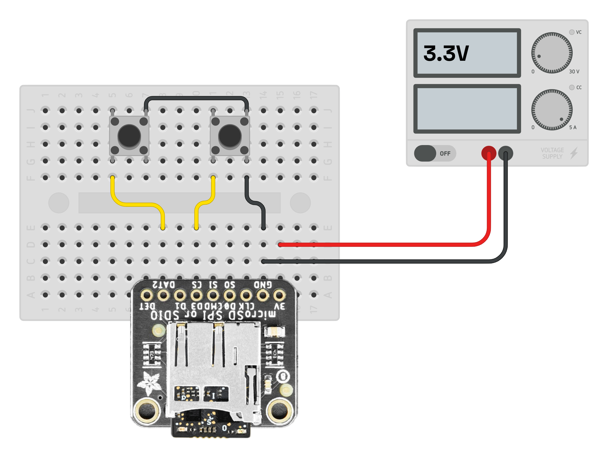

# Breathing example
This design alternatively pulses the red and green LEDs in a "breathing" motion. The design also supports changing the breathing speed using two pushbuttons connected as the diagram below shows:

### Build the `breathe-button` design:
- Make sure that the open-source CAD toolchain is properly installed.
- Navigate to `/verilog/breathe-button/` and run `make`. 
- After the example builds successfully, insert the Signaloid C0-microSD into your computer. The device should present itself as a 20.2 MB unformatted block storage device. Depending on your OS, you might be prompted to format the device. *Do not* format the device; instead ignore any prompt. The following is an example of the popup message you might see in MacOS:


- Verify the device path at which the Signaloid C0-microSD device shows up in your operating system. In our example, the Signaloid C0-microSD device path is `/dev/disk4`.
  - For MacOS do `diskutil list`
  - For Linux do `lsblk`
  - For Windows do `diskpart` followed by `list disk` and `exit`
  
  For example, running `diskutil list` on MacOS should return the following:
  ```
  % diskutil list
  ...

  /dev/disk4 (internal, physical):
  #:                       TYPE NAME                    SIZE       IDENTIFIER
  0:                                                   *20.2 MB    disk4
  ```
- Run `make program DEVICE=<device-path>`. Make sure to replace the `<device-path>` with the correct path of the C0-microSD. For example, if the device path is `/dev/disk4`, you will need to run `make program DEVICE=/dev/disk4`.

> [!NOTE]  
> To flash new bitstreams to the device, make sure that it is in bootloader mode (red LED turned on). If the device is not in bootloader mode, the `C0-microSD-toolkit` script will switch the device operation and will ask you to power cycle it. After that, retry running `make program DEVICE=<device-path>`.

> [!NOTE]  
> The shell script used to flash new bitstreams to the device (`C0-microSD-toolkit.sh`) has only been tested on MacOS and Linux.

If the bitstream flashed successfully, you should see:
```console
sudo ../../C0-microSD-toolkit.sh  -t /dev/disk4 -b top.bin
File name: "top.bin"
Device is in bootloader mode
Bitstream size:   104090 Bytes.
Loading user bitstream
Attempt 1 of 5
FLASHING...
VERIFY...
Success: The data matches
DONE
```

You can now unplug the C0-microSD from your computer and power it up using a microSD breakout board. After 3 seconds, you should see the red and green LEDs breathing alternatively.

### Schematic
```
                 VCC                         
┌────────────┐  ──┬──                        
│C0-microSD  │    │                          
│            │    │                          
│         3v3│────┘                          
│         GND├───────┐                       
│     SD_DAT2│───────┼───────────┐           
│     SD_DAT3├───────┼───────────┼───────┐   
└────────────┘       │           │       │   
                     │            /       /  
                   ──┴──         /       /   
                    GND          │       │   
                               ──┴──   ──┴── 
                                GND     GND  
```

### Breadboard configuration example

 
